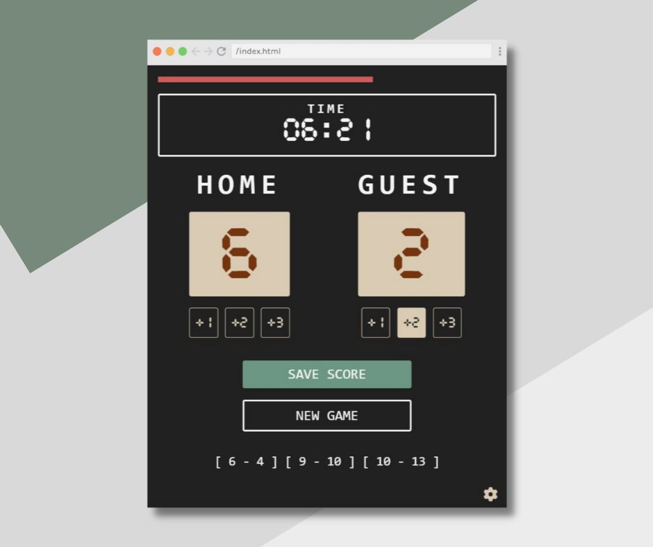

# Scrimba Solo Project - Scoreboard web app

Hello everyone 👋🏼,

This is my solo project for Basketball Scoreboard.

I created my own version and designed this scoreboard for every kind of game so that we can use it with our friends and family.

Check out my code scrim Scoreboard - [https://scrimba.com/scrim/co3e0457ea15acde13ed02994](https://scrimba.com/scrim/co3e0457ea15acde13ed02994)

Live: https://gretali.github.io/Scoreboard-web-app/

Repo: https://github.com/GretaLi/Scoreboard-web-app

## Scoreboard web app



### The challenge

- Buttons to add scores
- Button to save the current scores
- Button to reset the scores
- Count down timer
- Progress bar to show the current time percentage
- Gear to set the timer 10min/5min/1min/30sec

### Built with

- Semantic HTML5 markup
- CSS custom properties
- Flexbox
- Javascript

### What I learned

As I've learned JS for a couple of months, the main scoreboard function is a bit more comfortable for me to build.

In order to keep DRY code, for the increment function, I used parameters to determine how many scores and which team this button stands for.

```html
<button onclick="add(1, 'home')">+1</button>
...
<button onclick="add(3, 'guest')">+3</button>
```

```js
function add(score, team) {
  if (team == "home") {
    homeScore += score;
    homeEl.textContent = homeScore;
  }

  if (team == "guest") {
    guestScore += score;
    guestEl.textContent = guestScore;
  }
}
```

Timer function is the most challenging part for me, I googled some [resourse](https://surreal.tw/program/note/progessbar-timer) and adjust it to my project.

```js
let targetSeconds = 600; //defult 10 mins
let startTime = new Date().getTime(); // get starting time

const timer = function (startTime) {
  // get current time
  let currentTime = new Date().getTime();

  // passing seconds = (current time - starting time ) / 1000 ms
  let diffSec = Math.round((currentTime - startTime) / 1000);

  // remaining time = target seconds - passing seconds
  let remainingTime = targetSeconds - diffSec;

  update(remainingTime);

  if (remainingTime == 0) {
    resetTime(); // if time's up, reset the timer
  }
};

resetTime(); //rest time once load the page

function resetTime() {
  startTime = new Date().getTime();

  // setInterval method calls timer() function in every 1 sec
  setInterval(function () {
    timer(startTime);
  }, 1000);
}
```

- `The setInterval()` method calls a function at specified intervals (in milliseconds).

- The `setInterval()` method continues calling the function until `clearInterval()` is called, or the window is closed. (not using in this project)

- 1 second = 1000 milliseconds.

I'm happy to see the final result and super gassed to use these new techniques to my next project. 🥳

Chears! 💫

---

### Resources

- [Scrimba | The Frontend Developer Career Path](https://scrimba.com/learn/frontend/)

- [Font | Cursed Timer ULiL Font](https://www.fontspace.com/cursed-timer-ulil-font-f29411)

- [Timer function](https://surreal.tw/program/note/progessbar-timer)
